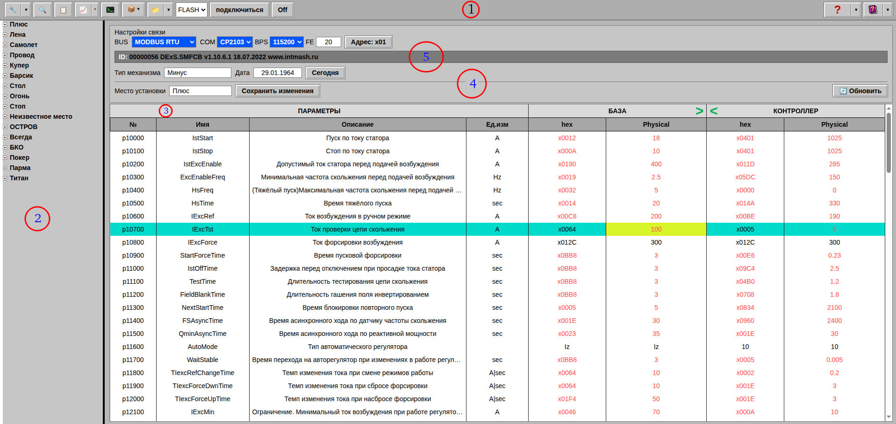
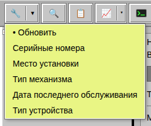
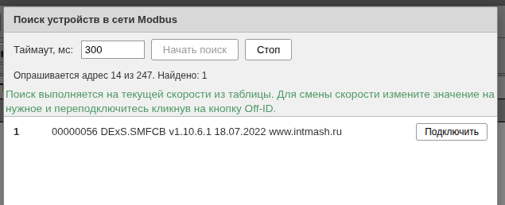

# 2. Интерфейс приложения
## 2.1. Главное окно приложения: 

Пространство главного окна логически разделено на пять полей: 
1 – Главное меню программы; 
2 – Каталог устройств;  
3 – Таблица редактирования уставок параметров устройства;  
4 – Панель дополнительной информации об устройстве;  
5 – Панель параметров связи; 

##  2.2. Меню кнопки "Обновить список устройств"

- Обновляет список устрйств и отслеживает изменения в загруженных ini файлах; 
- Выстраивает устройства по номерам; 
- Выстраивает устройства по месту установки; 
- Выстраивает устройства по типу механизма; 
- Выстраивает устройства по дате последнего обслуживания; 
- Выстраивает устройства по типу; 

##  2.3. Кнопка "Поиск устройств в сети Modbus"

