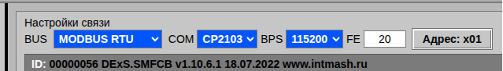
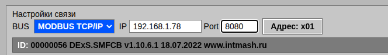

# 3. Подключение контроллера

Эта глава описывает порядок установления связи с контроллером и чтения идентификационной строки.

В верхней части окна расположены основные кнопки управления:

| Кнопка | Назначение |
|---|---|
| 🔧 | Список устройств: обновление, фильтрация по месту установки, типу и т.д. |
| 🔍 | Поиск устройств в сети Modbus |
| 📋 | Создание отчёта по текущей конфигурации |
| 📈 | Осциллограф: показ/скрытие и меню просмотра .rec-файлов |
| `>_` | Командная строка для ручного обмена с контроллером |
| 📁 | Открытие INI-файла или папки с ini файлами (только в Linux) |
| **Подключиться** | Установить соединение с контроллером, прочитать идентификационную строку устройства и искать среди загруженных ini файлов "родной" ini файл - с идентичным номером |
| **ID** | Установить соединение с контроллером и прочитать идентификационную строку устройства |
| ? | Поиск нужного ini файла по месту установки в раскрывающихся списках слева в таблице или поиск параметра по его номеру или имени |
|  | Открыть руководство пользователя / О программе |

## 3.1.  Настройки связи

Ниже верхней панели, в правой части экрана, расположены поля настройки связи. Их состав зависит от протокола, выбранного в списке **BUS**.

### Режим MODBUS RTU

Отображаются поля: **COM**, **BPS** (скорость), **FE** (длина кадра) и кнопка **Адрес** — адрес устройства в сети Modbus.

### Режим MODBUS TCP/IP

Отображаются поля: **IP** — адрес хоста, **Port** — TCP-порт (по умолчанию 8080) и кнопка **Адрес**.

## 3.2. Баннер ID

После успешного подключения в поле «ID» появляется строка идентификации устройства, например: `ID: 00000396 DExS.SMFCB v1.10.6.1 18.07.2022 www.intmash.ru`. Сокращённая версия (серийный номер и тип) выводится в шапке осциллографа.

## 3.3. Подготовка к подключению

При первичном запуске Ajuster нужно выбрать базовую папку в файловой системе с необходимым контентом ( папки с *.ini  файлами, папка Records...)

 *  Подключите контроллер к компьютеру  ( USB, RS-485 или Ethernet ). Выберите нужный порт в списке **COM** (режим RTU) либо укажите **IP** и **Port** (режим TCP/IP).

При необходимости задайте скорость в списке **BPS** и адрес устройства кнопкой **Адрес**.

*   Кликните кнопку **Открыть файл** или **Открыть папку** ( в Linux ) и выберите из базовой папки 1 или несколько *.ini файлов, или папку с *.ini  файлами ( в Linux ).

## 3.4. Установка соединения

Кликните кнопку **Подключиться**. Программа:

1. Предложит выбрать com  порт из доступных в системе
2. Откроет порт и пошлёт запрос идентификации.
   Номер порта не отображается в целях безопасности. Только имя преобразователя USB-to-UART
3. Считает строку ID и выведет её в поле «ID».
4. Найдёт среди загруженных ini-файлов «родную» конфигурацию по серийному номеру и типу устройства.

Если родной ini найден — он автоматически выбирается в списке устройств. Если не найден — открывается окно «Новое устройство».

## 3.5. Потеря связи

Если контроллер перестал отвечать, программа показывает сообщение «Контроллер не отвечает», а осциллограф замораживает графики. После восстановления связи опрос продолжится автоматически.